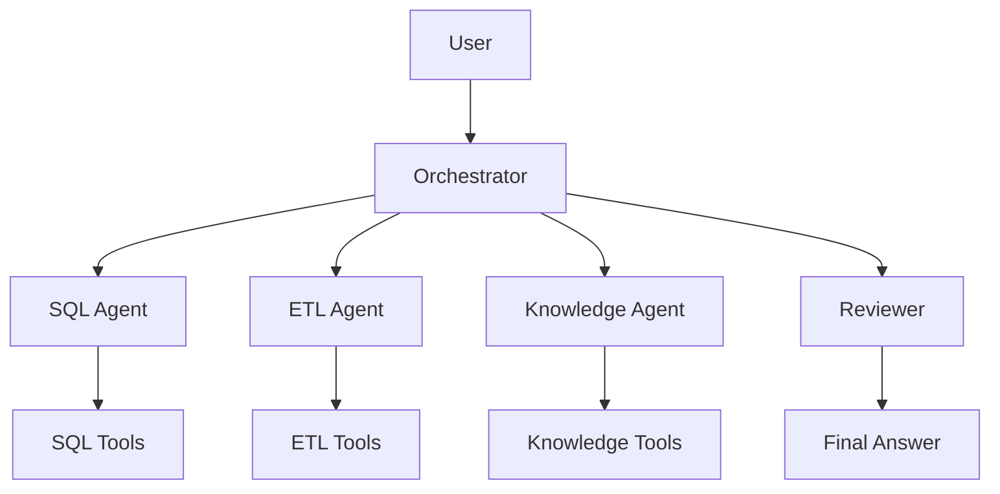

# Multi-Agent Data Engineering Copilot

## Overview
This project is a portfolio-grade synthetic environment for a multi-agent AI assistant built for data engineers. It helps with SQL questions, ETL and incident investigation, engineering documentation, historical incidents, data analysis, and SQL optimization. The goal is to demonstrate practical agent orchestration without over-engineering the system.

## Why Multi-Agent?
A single agent can do many tasks, but a multi-agent design becomes useful when each specialist has different tools, context, and validation needs. In this project:

- The SQL agent handles schema-aware, read-only SQL execution.
- The ETL agent analyzes job failures and logs.
- The Knowledge agent searches synthetic operational documentation.
- The reviewer validates evidence and guards against hallucination.

This is useful when a question spans multiple domains. A simple SQL request does not need ETL and documentation agents. A failure investigation often does.

## Architecture


## Agent Responsibilities
- Orchestrator: classify intent, select agents, create a minimal plan, and gather structured results.
- SQL Agent: inspect schema, generate safe SQL, validate, explain, and optimize read-only queries.
- Knowledge Agent: search synthetic documentation using a lightweight RAG flow and cite evidence.
- ETL Agent: review job history, logs, and incidents using synthetic ETL data.
- Reviewer: validate evidence, reject unsupported claims, and require additional evidence when needed.

## Tool Architecture
Each tool is an isolated service with validation and timeout logic. The SQL tool is strict read-only, the knowledge tool reads synthetic documentation, and the ETL tool inspects synthetic failure artifacts. This prevents stray behavior and makes the system explainable.

## Workflow
The orchestrator picks the smallest useful agent set. A simple SQL question routes to the SQL agent only. An ETL investigation may use the ETL agent and optionally the Knowledge agent. A complex incident review can include both operators before final reviewer validation.

## RAG
This project includes a minimal but practical RAG flow:

- synthetic documents
- chunked markdown content
- keyword and semantic-style matching
- evidence with source and section metadata

The system returns evidence with source and chunk details, and it explicitly says if evidence is unavailable.

## Security
Key controls include:

- read-only SQL enforcement
- blocklist for dangerous SQL statements
- no real secrets or credentials
- mock Jira approval gate
- prompt injection treated as untrusted document content
- structured audit metadata for request, agent, tool, and latency

## Evaluation
The project includes an evaluation dataset and runner that tests routing, SQL validation, retrieval, citation quality, and incident investigation. It produces a human-readable report.

## Observability
The system tracks request ID, agent, tool, duration, status, and errors without exposing hidden reasoning. The user-facing UI shows only safe metadata.

## Local Setup
```bash
python -m venv .venv
source .venv/bin/activate  # Windows: .venv\Scripts\activate
pip install -r requirements.txt
python -m pytest -q
uvicorn app.api.main:app --reload
streamlit run streamlit_app/app.py
```

## Docker
```bash
docker compose up --build
```

## Examples
- Show me customers with revenue above 100000.
- Why did the Customer_Load job fail yesterday?
- What is the recommended rollback procedure?
- Investigate the Customer_Load failure and summarize the findings.
- Optimize this SQL query.
- Create a Jira ticket for this confirmed issue.

## Limitations
This is a synthetic portfolio implementation. It does not connect to real enterprise systems or production monitoring. It intentionally avoids real credentialed integrations.

## Future Improvements
Possible extensions include real Jira, Confluence, SQL Server, cloud deployment, enterprise monitoring, MCP, authentication, and advanced agent orchestration.

## Files and Why They Exist
- app/agents: separate specialist logic for clear responsibilities.
- app/tools: isolated tool behavior with validation.
- app/workflows: orchestration and state flow.
- app/models: safe, typed interfaces between agents.
- app/api: HTTP entry points.
- database: schema and synthetic seed data.
- synthetic_data: documents and incident examples.
- evaluation: scoring and scenario coverage.
- streamlit_app: user interface.

## Important Notes
This is a portfolio implementation with synthetic data and mock integrations. It is designed to be easy to explain, test, and extend without making false claims about production deployment.
